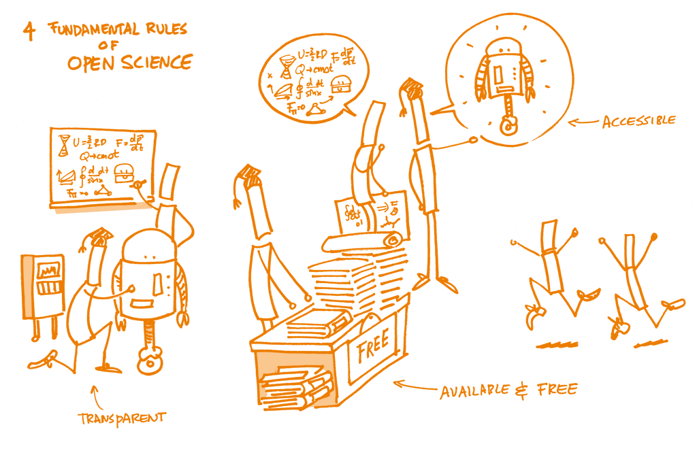

# Let's move a little bit

We have some prepared cards with the most common and used git commands. It is not extensive and non repetitive.

- In small groups, you have 10 min to paste an ordered sequence of commands on the board, including some cards that might be missing.

- Then, we will have then 3 min to discuss what you remember and how you remembered it. Also, we want to discuss what are the benefits of saving track of changes this way, and what could be an even better option?

#### [Next: GitHub](./005_github.md)
